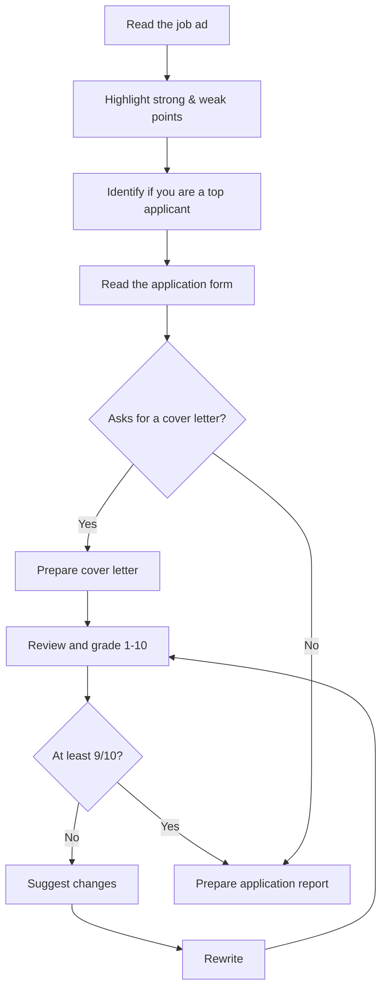

# Ieakaso

Ieakaso helps professionals find jobs that truly fit where they want their career to go next: not just any opening, the right one.
It tracks applications from first listing to offer, so nothing slips through, and guides you through interview prep along the way.

## How it works

Paste a job ad URL. Is it a match for you? Would you be a top applicant?

1. **You paste the URL** of the job ad in the prompt.
2. **It tells you if you are a top applicant**, after weighing the strong and weak points of the posting against your profile.
3. **It tells you what is next**: what the application form asks for and what you need to apply.
4. **It hands you two drafts**: a cover letter (when the form asks for one) and an application report.

You read them. You send them.

## Two agents, one review loop

Ieakaso runs two agents with opposite jobs:

- **Applicant Agent** writes. It reads the job ad and the application form, drafts the cover letter, rewrites it, and prepares the application report.
- **Seasoned Recruiter** judges. It highlights the strong and weak points of the posting, decides whether you are a top applicant, and grades every cover letter from 1 to 10.

A cover letter only reaches you once the Recruiter grades it at least 9/10. Below that, the Recruiter suggests changes and the Applicant rewrites.



## Getting started

Ieakaso runs locally inside a coding-assistant CLI: [Claude Code](https://claude.com/claude-code) or [OpenCode](https://opencode.ai).

On first launch it asks for your memory, in chat. Nothing to configure by hand:

- your CV
- who you are as a professional
- your most important projects
- your biggest achievements
- a personal SWOT

You run Ieakaso as `/ieakaso <mode>`. You can also pick the mode from the `/` menu: type `/ieakaso:` in Claude Code or `/ieakaso-` in OpenCode. In Claude Code, start it from the repo root. Plain `/ieakaso` asks which mode to run.

To set up, put your CV in `input/documents/cv/` and run:

```
/ieakaso init
```

It checks your documents, strongly recommends your LinkedIn "Save to PDF" export (`input/documents/linkedin/`), suggests reference letters (`input/documents/reference_letters/`), and asks you to confirm your details, target positions, and search location. It saves them in `config.yml`. Run it again any time to review or update them. Other modes run it for you if setup is incomplete.

Init also turns your CV into `input/cv.md`, word for word: nothing reworded, added, or left out. When you change your CV, the next mode you run updates `input/cv.md` for you, or run it yourself:

```
/ieakaso cv-parser
```

Edit your CV, not `input/cv.md`: it is regenerated from the CV.

Then ask whether a job ad is worth applying to. Give its URL, or paste its text:

```
/ieakaso job-analyzer <job-url or job-ad text>
```

The job analysis lands in `output/job-analysis/`: a verdict (Top applicant, Apply, Stretch, Don't apply), your strengths and weaknesses for the role, and what your CV under-sells.

The first runs are rough. It does not know you yet.
Talk to it: what you want, what you refuse.
Think of it as a recruiter's first week.

## Your data

Every application lives on your machine, as Markdown files in a plain folder tree. An application's status is the folder it sits in:

```
applications/
├── applied/
├── interviewing/
├── offer/
└── not-selected/
```

An application moves from `applied` to `interviewing` to `offer`, or to `not-selected` at either stage.

Ieakaso learns from every application it follows and folds what it learns back into its memory of you. Your data leaves your machine only to reach the AI provider you chose.

## What Ieakaso will not do

- **Submit an application.** It drafts; you review and click Submit.
- **Send or check emails.** Drafts only. You paste them in your email client, you send.
- **Invent your CV.** It reformulates your experience; it never fabricates it. Read every draft before you send it.

## Roadmap

- **Interview prep flow.** Guidance from first call to offer.
- **Still open?** Check that a posting is still live, and spot reposts, before you write a word.
- **Richer fit score.** Score the position against your LinkedIn profile too. You can override the score.
- **CV and form answers.** Suggest CV changes for each posting and draft answers for every field of the application form.
- **Who do I talk to?** Find the hiring manager or recruiter and draft a note. It never sends it.
- **What should I learn?** After a run of rejections, name the gap.
- **Honest advice.** Recommend not applying when the fit is low. You can override it, and it will say so.
- **Fabrication check.** Block any CV draft whose facts or numbers are not in your memory.

## License

[AGPL-3.0](LICENSE)
